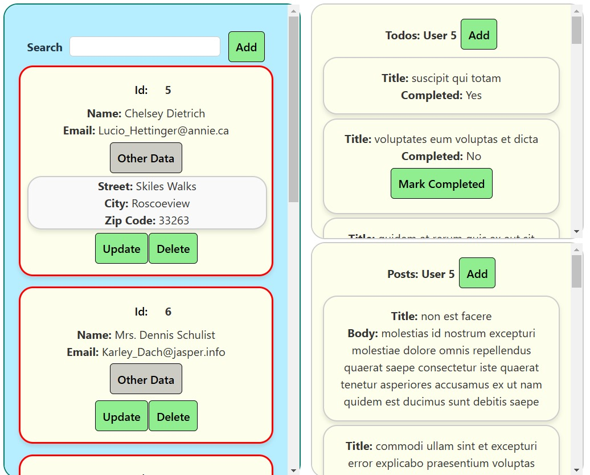

# User Management Application

An intuitive application designed for managing users, their tasks (todos), and posts. 
Built using **React**, with a focus on modularity and user experience.

---

## Features

- **Users Management:**
  - Add, update, and delete users.
  - View user-specific tasks and posts.
- **Todos Management:**
  - Add new todos for users.
  - Mark todos as completed.
- **Posts Management:**
  - Add new posts for users.
  - View all posts associated with a user.
- **Search Functionality:**
  - Easily find users by name or email.
- **Dynamic Styling:**
  - Visual distinction between users based on todo completion status.
    
---


---

## Installation

1. Clone the repository:
   ```bash
   git clone https://github.com/yourusername/UserManagementApp.git
   cd UserManagementApp
   ```

2. Install dependencies:
   ```bash
   npm install
   ```

3. Start the application:
   ```bash
   npm start
   ```

4. Open the application in your browser at:
   ```
   http://localhost:3000
   ```

---

## Usage

### Admin Panel
1. Open the application and log in as an admin (if applicable).
2. Use the search bar to locate users quickly.
3. Add, edit, or delete users using the respective buttons.
4. Manage todos and posts for each user.

### Todos and Posts
- Todos: View, add, and mark tasks as completed.
- Posts: View and add new posts for users.

---

## File Structure

```plaintext
src/
├── components/
│   ├── Users/
│   │   ├── User.jsx
│   │   ├── Users.jsx
│   │   ├── AddUser.jsx
│   │   └── UpdateUser.jsx
│   ├── Todos/
│   │   ├── Todo.jsx
│   │   ├── Todos.jsx
│   │   └── AddTodo.jsx
│   ├── Posts/
│   │   ├── Post.jsx
│   │   ├── Posts.jsx
│   │   └── AddPost.jsx
├── App.jsx
├── index.js
└── styles.css
```

## Technologies Used

- **Frontend:** React
- **Styling:** CSS
- **Unique IDs:** UUID library

---

## Contributions

Contributions are welcome! Please fork the repository and create a pull request with your updates.

---

## License

This project is licensed under the MIT License. See the LICENSE file for details.
